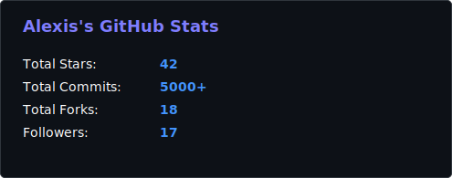

<h1 align="center">
  
     Hi 👋, I'm Alexis Manuel Hurtado García
  
</h1>
<h3 align="center" style="color:#4394FF;">💻 Cuban Software Engineer | Full-stack & Mobile Developer | Passionate about clean, scalable code 🚀</h3>

  

---

### 🧑‍💻 About Me  
- 🇨🇺 I'm **Alexis Manuel Hurtado García**, a Software Engineer from Cuba  
- 🎂 I'm **26 years old** and have **6 years of experience** in the industry
- 🌍 Bilingual: I speak **Spanish** and **English**  
- 💡 I'm passionate about building **scalable applications** and I love **refactoring code** to perfection 🚀
- ⚙️ My favorite technologies are **Golang**, **Laravel**, **Vue**, and **Flutter**
- 🖥️ I also work with Dart, TypeScript, React, Quasar, Node.js, Express, Next.js, Inertia, and build desktop apps with Go + Wails
- 🌱 I focus on clean architecture, patterns, and full-stack development  

---

### 🛠️ Tech Stack  

  <h5>Frontend</h5>
  
  
  
  
  
  
  
  
  
  

  <h5>Backend & Databases</h5>
  
  
  
  
  
  
  

  <h5>Tools & Others</h5>
  
  

---

### 🚀 Projects I've Contributed To

  
  
  
  
  
  

---

### 📊 GitHub Stats  

  
    

  
    

### 🔥 GitHub Activity  

  

### 📈 Quick Stats

---

### 📫 Connect With Me  

  
    
    
    
  
  
  
  

---

⭐️ From [A4GOD-AMHG](https://github.com/A4GOD-AMHG)
